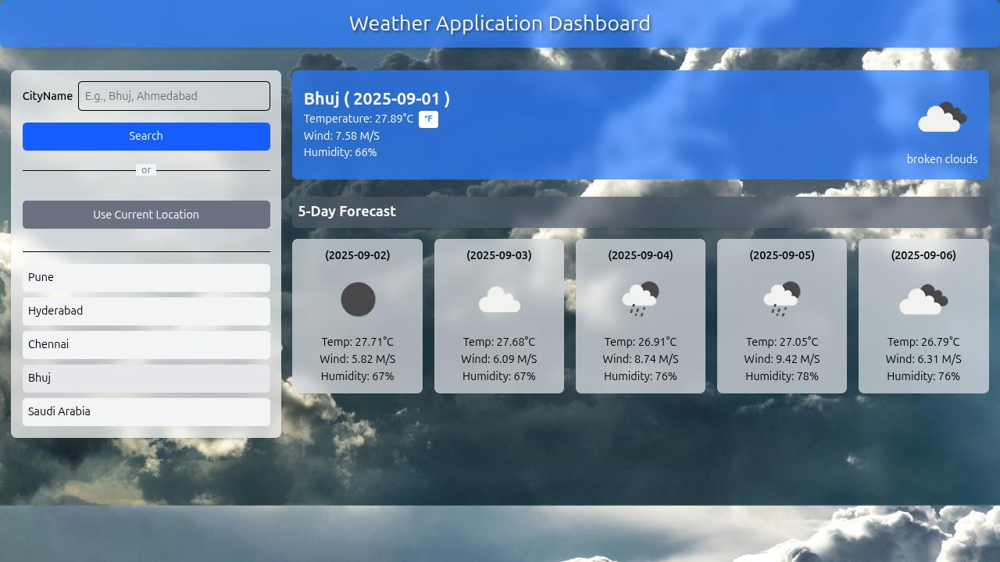

# Weather Dashboard Application

A dynamic and responsive weather forecast application built with HTML, Tailwind CSS, and vanilla JavaScript. This application allows users to get real-time weather data for any city in the world or for their current location, using the OpenWeatherMap API.



---

## Objective

The goal of this project was to develop a complete weather forecast application that is both functional and user-friendly. Key objectives included API integration, building a creative and responsive user interface, and implementing essential features like location-based forecasts, dynamic UI updates, and local storage for recent searches.

---

## Features

-   **Search by City:** Get the current weather and a 5-day forecast for any city.
-   **Use Current Location:** Instantly fetch weather data for your current geographical location with a single click.
-   **Dynamic UI:** The user interface updates instantly with new weather data.
-   **Recent Searches:** The application saves your last 5 searches in local storage for quick access.
-   **Temperature Toggle:** Switch the current day's temperature between Celsius (°C) and Fahrenheit (°F).
-   **Dynamic Backgrounds:** The application's background image changes to reflect the current weather conditions (e.g., rain, clouds, clear sky).
-   **Custom Weather Alerts:** Displays a prominent warning for extreme heat (temperatures above 40°C).
-   **Responsive Design:** The layout is fully responsive and looks great on desktop, tablet (iPad), and mobile (iPhone SE) screens.
-   **User-Friendly Error Handling:** Custom error messages are displayed in the UI for invalid searches or location access errors.

---

## Technologies Used

-   **HTML5:** For the basic structure and content of the application.
-   **Tailwind CSS:** For all styling and creating a responsive, modern design.
-   **JavaScript (ES6+):** For all application logic, including API calls, DOM manipulation, and handling user events.
-   **OpenWeatherMap API:** To source real-time weather and forecast data.
-   **Browser Geolocation API:** To get the user's current location.
-   **Git & GitHub:** For version control and project management.

---

## Setup and Installation

To run this project locally on your machine, follow these simple steps:

1.  **Clone the repository:**
    ```bash
    git clone https://github.com/NPVarsani/weather-app.git
    ```

2.  **Navigate to the project directory:**
    ```bash
    cd weather-app
    ```

3.  **Get your own API Key:**
    -   Go to [OpenWeatherMap](https://openweathermap.org/api) and sign up for a free account.
    -   Navigate to the "API keys" section to get your unique API key.
    -   Open the `script.js` file and replace the placeholder `apiKey` with your own key.

4.  **Open the application:**
    -   Simply open the `index.html` file in your web browser. You can do this by double-clicking the file or by using a live server extension in your code editor (like Live Server for VS Code).

---
